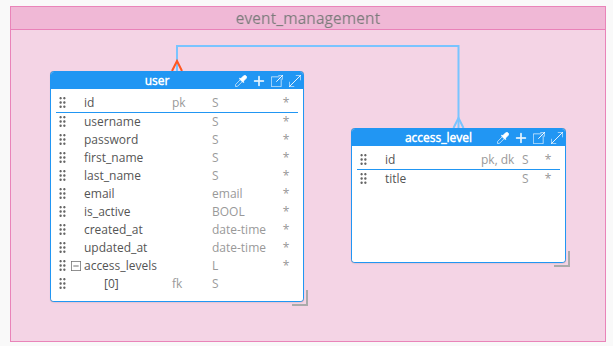

# Banco de Dados - Auth Service

## Tecnologia

O serviço utiliza **Amazon DynamoDB** como banco de dados NoSQL. Para o ambiente de desenvolvimento, a stack AWS é emulada localmente com **Ministack**, executado via Docker Compose, e provisionada de forma declarativa com **[Terraform](https://www.terraform.io/)**. Como o DynamoDB não impõe regras de esquema, a validação dos dados é responsabilidade do backend em **FastAPI**.

### Stack local

| Componente | Função |
| --- | --- |
| **Ministack** | Container que emula os serviços AWS (DynamoDB e SNS) na porta `4566` |
| **Terraform** | Provisiona a tabela `user` (+ índices) e o tópico SNS `user-events` no Ministack |
| **AWS provider** | Aponta para o endpoint local (`http://localhost:4566`) com credenciais fictícias (`test`/`test`); o mesmo endpoint serve DynamoDB e SNS |

## Configuração e Instalação

### Opção recomendada: Docker Compose na raiz

A forma mais simples de subir a infra é pelo `docker-compose.yml` na **raiz** do
repositório, que orquestra `infra` (Ministack) e `backend`. Da raiz do projeto:

```bash
docker compose up -d
```

Em dev, o backend cria a tabela `user` e seus índices (`email-index`,
`username-index`) automaticamente no startup (lifespan) — não é preciso
provisionar manualmente. O container `infra` não é recriado entre `up`s enquanto
a config não muda, e o DynamoDB persiste no volume `ministack-data`.

> **Atenção (US-29):** o backend **não** cria o tópico SNS `user-events` no
> startup — só a tabela DynamoDB. Para o tópico existir (e o evento
> `UserProfileChanged` ser publicado de fato), é preciso rodar o Terraform via
> profile `provision` abaixo. Sem o tópico, a publicação é no-op best-effort
> (logada, sem quebrar o cadastro).

O provisionamento via **Terraform** continua disponível como passo **opcional**,
isolado no profile `provision` (fora do caminho crítico, para que uma falha não
derrube o stack). Ele roda os arquivos desta pasta via [`provision.sh`](provision.sh)
e cria a tabela `user` e o tópico `user-events` apenas se ainda não existirem
(estado no volume `tfstate`):

```bash
docker compose --profile provision up provision
```

> **Caveat do fast-path:** o [`provision.sh`](provision.sh) pula o Terraform se o
> state já contém `aws_dynamodb_table`. Em um volume `tfstate` provisionado antes
> da US-29, o tópico SNS **não** será criado até reprovisionar do zero
> (`docker compose down -v` e subir de novo).

Veja o [README da raiz](../README.md) para o fluxo completo.

### Opção alternativa: Terraform direto no host

Útil para inspecionar/alterar a infra manualmente. Requer:

- [Docker](https://docs.docker.com/get-docker/) e Docker Compose
- [Terraform](https://developer.hashicorp.com/terraform/downloads) `>= 1.5`

Suba só o Ministack pela raiz e aplique o Terraform desta pasta (o endpoint
default já aponta para `http://localhost:4566`):

```bash
docker compose up -d infra   # na raiz: sobe só o Ministack
cd infra
terraform init
terraform apply
```

### (Opcional) Verifique a tabela e o tópico

Com a [AWS CLI](https://docs.aws.amazon.com/cli/) instalada, é possível inspecionar o estado do Ministack local:

```bash
aws --endpoint-url=http://localhost:4566 dynamodb list-tables
aws --endpoint-url=http://localhost:4566 sns list-topics      # deve listar user-events
```

### Encerrando

```bash
# Na raiz do projeto:
docker compose down      # para os containers (mantém os dados nos volumes)
docker compose down -v   # para e apaga os volumes (zera a infra)
```

> Os dados do Ministack e o estado do Terraform ficam nos volumes nomeados
> `ministack-data` e `tfstate`. Use `docker compose down -v` para começar do zero.

## Modelagem do Banco de Dados

A modelagem foi projetada na aplicação **Hackolade**. Ela foi projetada para suportar autenticação, controle de acesso e gerenciamento de usuários com eficiência.



### Por que DynamoDB?

A escolha do DynamoDB como banco NoSQL se dá pela simplicidade do modelo chave-valor, que atende bem aos padrões de acesso do serviço de autenticação — predominantemente consultas diretas por `id`. Combinado com **Ministack**, é possível rodar toda a stack AWS em container, sem depender de serviços externos durante o desenvolvimento e testes.

### Validação dos dados

Como o DynamoDB não impõe regras de esquema, toda a validação é responsabilidade do backend em **FastAPI**, que garante:

- Unicidade de `username` e `email`;
- Formato válido de e-mail e tamanhos mínimos/máximos de campos de texto;
- Senha com mínimo de 8 caracteres, contendo letras maiúsculas, minúsculas, números e caracteres especiais (validada antes do hash);
- Obrigatoriedade dos campos marcados como não nulos na modelagem;
- Validade do papel `user.access_level` contra o enum `Role` (PARTICIPANT/MANAGER/ADMIN).

### Remoção lógica

Os registros da tabela `user` não são removidos fisicamente do banco. Em vez disso, o campo `is_active` é marcado como `false`, preservando o histórico e evitando quebra de referências em outras partes do sistema.

## Tabelas e Dicionário de Dados

### Principais Tabelas

| Tabela | Partition Key | Descrição |
| --- | --- | --- |
| `user` | `id` (UUID) | Armazena usuários cadastrados no sistema |

### Dicionário de Dados

#### user

| Atributo | Tipo | Descrição | Exemplo |
| --- | --- | --- | --- |
| `id` | String (UUID) | Atributo de identificação do usuário | `"acde070d-8c4c-4f0d-9d8a-162843c10333"` |
| `username` | String | Nome de usuário único para login | `"juca.bala_42"` |
| `password` | String | Hash bcrypt da senha do usuário | `"$2b$12$KIXxPfBpz5gQmJ4rL8xH2.eV3kN9tZwQ5cR7sD1aB6hG8jM0nP4qO"` |
| `first_name` | String | Nome social do usuário | `"Juca"` |
| `last_name` | String | Sobrenome do usuário | `"Bala"` |
| `email` | String | e-mail único do usuário | `"jucabala@email.com.br"` |
| `is_active` | Boolean | Verificador de usuário ativo para remoção lógica | `true` |
| `created_at` | String (date-time) | timestamp do momento de cadastro do usuário | `2001-09-11T12:30:00Z` |
| `updated_at` | String (date-time) | timestamp da última atualização do cadastro do usuário | `2026-04-11T14:30:00Z` |
| `access_level` | String (enum) | Papel único do usuário: `PARTICIPANT`, `MANAGER` ou `ADMIN` | `"PARTICIPANT"` |

### Papel de acesso (`access_level`)

O papel é um **enum no código** (`Role`), não um registro de banco. Os scopes
do JWT são derivados do papel de forma **cumulativa** (ADMIN ⊇ MANAGER ⊇
PARTICIPANT). Não há tabela de catálogo nem integridade referencial a manter —
a validade do valor é garantida pelo backend (Pydantic + domínio).

## Mensageria — Tópico SNS (US-29)

Além do DynamoDB, a infra provisiona um **tópico SNS** para a integração
assíncrona entre microsserviços. Definido em [`sns.tf`](sns.tf), com o endpoint
SNS do provider apontando para o mesmo Ministack (`http://localhost:4566`).

| Recurso | Nome | Função |
| --- | --- | --- |
| `aws_sns_topic` | `user-events` | Tópico onde o Auth publica eventos de usuário |

### Evento `UserProfileChanged`

O Auth publica neste tópico sempre que a **demografia** (`age`, `area`,
`gender`, `city`) ou o **papel** (`access_level`) de um usuário é criado/alterado
(via `register`, `update_profile` ou `admin_update`). Consumidores (ex.: o
microsserviço Metrics) assinam o tópico via SQS para enriquecer suas métricas —
o fan-out por SNS mantém o Auth desacoplado de quem consome.

- **ARN (Ministack):** `arn:aws:sns:us-east-1:000000000000:user-events`,
  configurável via `SNS_USER_EVENTS_TOPIC_ARN`.
- **Publicação best-effort:** uma falha de SNS é logada mas não quebra o
  cadastro/atualização.
- **Contrato completo do payload:** ver [INTEGRATION.md §8](../INTEGRATION.md).
